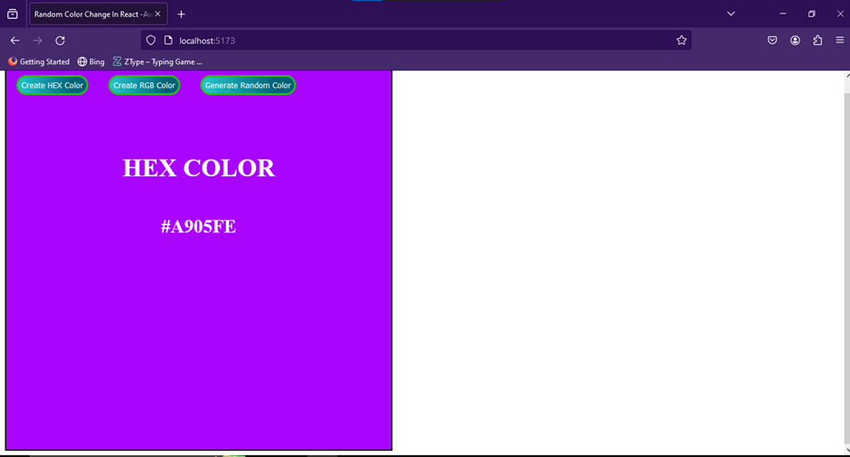

# Random Color Change Project IN React

This project is a simple React application that changes the background color randomly in HEX and RGB when generate random color button is clicked.

## Features
- fully responsive and SEO 80% accessibility 100% performance 90% and etc. by 
  lighthouse.
- Randomly changes the background color of the page(div).
- Uses React to handle UI components and state.

## Demo

## Installation

1. Clone the repository
2. Navigate into the project directory
3. Install dependencies

## Usage

1. Start the development server.

2. Open your browser and go to [http://localhost:5173/]
(http://localhost:5173/).

3. Click the "Generate Random Color" button to see the background color change randomly.

